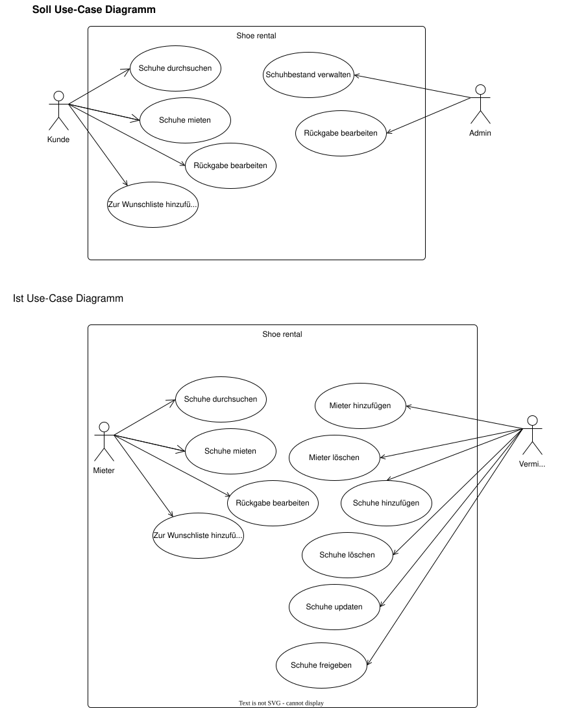
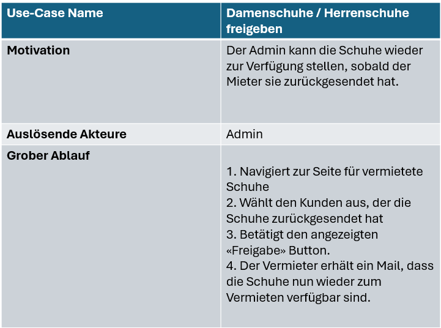
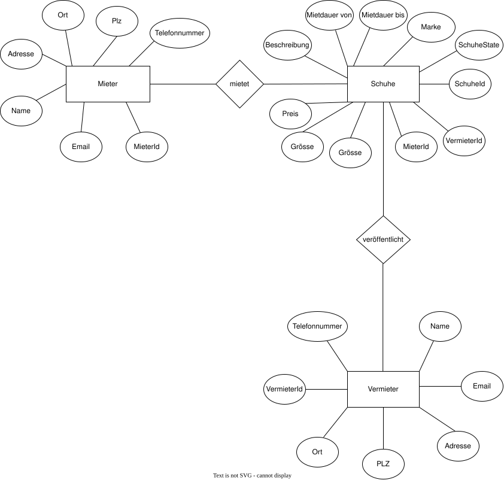
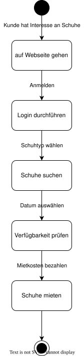

# USE-CASE DIAGRAMM

# USE-CASE BESCHREIBUNG
In diesem Abschnitt werden das Use-Case-Diagramm sowie die Use-Case-Beschreibung be-handelt, die zwei Hauptakteure identifizieren – Den Vermieter und den Mieter. Der Vermieter, der gleichzeitig der Betreiber der Plattform «Shoerental» ist, fungiert als alleiniger Eigentümer und bietet seine Schuhe zur Miete an. Der Vermieter hat die Befugnis, die Schuhe (Damen- und Herrenschuhe) zu aktualisieren (durch Preisanpassungen oder andere Felder) oder sie zu löschen. Zusätzlich kann er die Mieterseite bearbeiten und Mieter löschen. Des Weiteren kann der Vermieter die Schuhe nach der Rücksendung durch den Mieter erneut freigeben. Durch diese Freigabe ändert sich der Status von Vermietet auf Verfügbar, wodurch das Kleidungs-stück für den nächsten Mieter verfügbar wird. Der Mieter hingegen kann Schuhe mieten. Nachdem er ein paar Schuh gemietet hat, erhält er eine Benachrichtigung per E-Mail über die Dauer der Mietzeit. Sobald der Mieter das paar Schuh zurückgibt und der Vermieter es entge-gennimmt, kann der Vermieter den Freigabe-Button betätigen. In diesem Fall wird dem Mieter eine Benachrichtigung per E-Mail zugesendet, dass die Schuhe erfolgreich zurückgesendet wurde.

# Fachliches Datenmodell (ER-Modell) mit Erläuterungen

Im ER-Modell sind drei Entitäten definiert: Mieter, Schuhe und Vermieter. Ein Vermieter kann 
beliebig viele Schuhe publizieren bzw. online stellen. Einem Mieter kann nur ein 
Schuh zugewiesen werden, jedoch kann ein Mieter mehrere Schuhe mieten. Jede der drei Entitäten besitzt einen Primärschlüssel. Die Entität "Schuhe" verfügt über zwei 
Fremdschlüssel: "MieterId" und "VermieterId". Wenn ein Vermieter ein paar Schuh publiziert, wird der VermieterId-Attribut der Schuhe mit der ID des Vermieters belegt. Beim Mieten eines Schuhs wird das MieterId-Attribut des Schuhs mit der ID des Mieters versehen. Beim Publizie-ren eines Schuhs ist der Standardstatus des Attributs "SchuhState" immer "VERFÜGBAR". 
Sobald ein Mieter das paar Schuh mietet, ändert sich der Status auf "VERMIETET". Während ein Schuh vermietet ist, kann es von keinem anderen Kunden gemietet werden. Wenn der Mieter die Schuhe zurückgibt und der Vermieter den Freigabe-Button betätigt, ändert sich der SchuheState von "VERMIETET" zu "VERFÜGBAR". Somit steht der Schuh allen Mietern zur Verfügung. Bei der Publikation eines Schuhs kann der Vermieter den Schuhtype wählen, ent-weder "Damenschuhe" oder "Herrenschuhe". Das Attribut "SchuheType" ist ein ENUM und erlaubt derzeit nur die Auswahl zwischen Frauenschuh und Maennerschuh. Auch das Attribut "SchuheState» ist ein ENUM.

# Zustandsdiagramm für die Entität, welche mehrere Zustände durchläuft mit Events, Effects und Guards.

# Liste mit nicht funktionalen Anforderungen

1. Performance
Das System sollte mindestens 100 gleichzeitige Nutzeranfragen verarbeiten können, ohne signifikante Verzögerungen (<1 Sekunde Ladezeit für gängige Aktionen wie Login, Mieten oder Anzeigen von Schuhen).

2. Sicherheit
Datenverschlüsselung:
Alle Nutzerdaten (Passwörter, E-Mails, etc.) müssen verschlüsselt gespeichert werden.

Rollenbasierter Zugriff:
Admins sollten nicht die Passwörter anderer Benutzer einsehen können.

Datenschutz:
Nutzerdaten dürfen nicht ohne Zustimmung an Dritte weitergegeben werden.

3. Skalierbarkeit
Das System sollte skalierbar sein, um in Zukunft mehrere Tausend Nutzer gleichzeitig zu unterstützen.

4. Verfügbarkeit
Das System sollte eine Verfügbarkeit von 99,9% gewährleisten (maximal 1 Stunde Ausfallzeit pro Monat).
Geplante Wartungsfenster sollten außerhalb der Hauptnutzungszeiten liegen.

5. Benachrichtigungssystem
Das System muss ein flexibles Benachrichtigungssystem bereitstellen, das verschiedene Kommunikationskanäle (z. B. SMS, E-Mail) unterstützt.

6. Fehlertoleranz
Wenn ein Teil des Systems (z. B. der E-Mail-Versand) ausfällt, sollte der Rest weiterhin funktionsfähig bleiben.
Fehlerhafte Aktionen (z. B. ungültige Eingaben) sollten Benutzer mit klaren Fehlermeldungen informieren.

# Mockup oder Skizze des UIs

